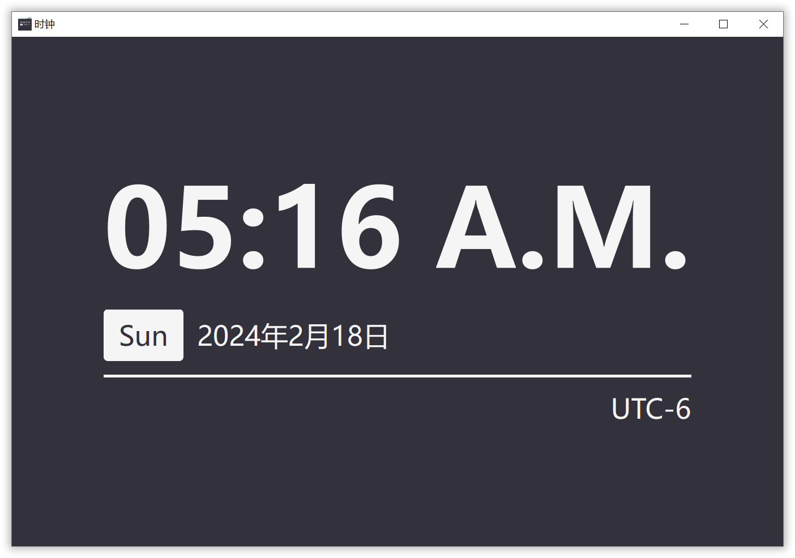

[中文](../zh-cn/readme.md) | English


<details>
  <summary>Table of Contents</summary>
  <ol>
    <li>
      <a href="#about-the-project">About The Project</a>
      <ul>
        <li><a href="#built-with">Built With</a></li>
      </ul>
    </li>
    <li>
      <a href="#getting-started">Getting Started</a>
      <ul>
        <li><a href="#prerequisites">Prerequisites</a></li>
        <li><a href="#installation">Installation</a></li>
        <li><a href="#downgrade-to-Qt5">Downgrade to Qt5</a></li>
      </ul>
    </li>
    <li><a href="#usage">Usage</a></li>
    <li><a href="#roadmap">Roadmap</a></li>
    <li><a href="#contributing">Contributing</a></li>
    <li><a href="#license">License</a></li>
    <li><a href="#acknowledgments">Acknowledgments</a></li>
  </ol>
</details>

# About The Project

A simple clock application written with Qt that displays current date, time, day of the week and time zone.

# Built With
This project is built with: 

- 

## Getting Started

**Please note**: The CMake and Qt versions used by the project is relatively newer, and you can use older versions to build the project.

### Prerequisites

Before building, make sure you have `Qt` and `CMake`. Our recommended version for Qt is 5.15.15+. If you need to complie the project with Qt5, please read the section _Downgrade to Qt5_.

Then, you willl need to modify the cmake prefix in `CMakeLists.txt`. An example is given below.

  ```cmake
  set(CMAKE_PREFIX_PATH "D:/IDE/Qt/6.7.0/msvc2019_64")
  ```

### Installation

1. Clone the repository, `cd` to the root directory of the project that includes `CMakeLists.tst`. Then, create a directory called `Build`.

   ```sh
   mkdir build
   cd build
   ```
2. Build the project.
   ```sh
   cmake ..
   ```

### Downgrade to Qt5

To build the project with Qt5, you will need to change the CMake prefix, and change `find_package(Qt6 COMPONENTS` into `find_package(Qt5 COMPONENTS`.

```cmake
cmake_minimum_required(VERSION 3.28)
project(Clock)

set(CMAKE_CXX_STANDARD 17)
set(CMAKE_AUTOMOC ON)
set(CMAKE_AUTORCC ON)
set(CMAKE_AUTOUIC ON)

set(CMAKE_PREFIX_PATH <path_to_qt>)

find_package(Qt5 COMPONENTS
        Core
        Gui
        Widgets
        REQUIRED)
```

## Usage

Currently the application only displays time, the user manual will be updated when we implemented the "world clock" and the preference window.

### Roadmap
- [x] Basic functions
- [ ] Work clock
- [ ] Time adjusting
- [ ] Frameless window & full screen mode
- [ ] Alarm clock
- [ ] Multi-language support
    - [x] Chinese
    - [ ] English

### Contributing
- Please submit an issue if you find a bug.
- We welcome pull requests to improve the application.

### License

The project is licensed under GNU Public License 2.0. You can find a copy of the license in the file `LICENSE`.

### Acknowledgments

- Frameworks
    - Qt
- Tools
    - CMake
- Fonts
    - Ubuntu
- Documentation
  - Best-README-Template